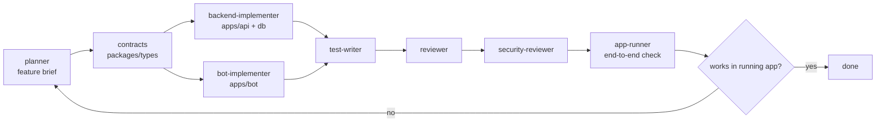

# AGENTS.md — multi-agent workflow

BeoSand ships a Claude operating layer under `.claude/`. For anything larger than a one-file change,
run the heavier flow below instead of editing ad hoc. The same guidance applies whether a human or a
subagent does the work.

## Roles (`.claude/agents/*`)

| Agent | Responsibility |
| --- | --- |
| `planner` | Clarify scope, pick the smallest correct slice, write the feature brief. Delegates; does not implement. |
| `backend-implementer` | `apps/api` modules + `packages/types` contracts + `packages/db` schema/migrations. |
| `bot-implementer` | `apps/bot` flows/keyboards calling the API. No domain logic in the bot. |
| `test-writer` | Vitest unit/integration tests for the changed behavior. |
| `reviewer` | Correctness + invariant review of the diff. |
| `security-reviewer` | Authz (telegram_id ownership/role), input validation, secrets, money/availability integrity. |
| `app-runner` | Run API + bot (and DB) and confirm the feature actually works end to end. |

## Flow

1. **Plan.** `planner` reads the spec slice + `docs/architecture/*`, clarifies open questions, and
   writes/updates `docs/product/features/<slug>.md` (goal, contracts/tables touched, API endpoints,
   bot flow, acceptance criteria, tests, dependencies).
2. **Contracts first.** Add/adjust Zod contracts in `packages/types` and any schema in `packages/db`
   (with a generated migration) before wiring services — they are the source of truth.
3. **Implement.** Backend and bot in parallel against the agreed contracts. Backend owns all domain
   decisions, recompute, and money/availability; the bot only renders and calls the API.
4. **Test.** Cover valid input, invalid input, the unsafe/forbidden case, and the invariant the
   feature touches (capacity recompute, status flip, monthly batch, single-date cancel, 6-per-hour).
5. **Review → security review.**
6. **Run.** `app-runner` boots the stack and exercises the flow. A feature is **done only when it
   works in the running bot/API or a concrete blocker is reported** — never "should work".

## Definition of done

- `pnpm typecheck && pnpm lint && pnpm test && pnpm build` green.
- Behavior verified in the running app (or a precise blocker documented).
- Superseded code removed; remaining legacy named in the summary.
- The feature brief's acceptance criteria are all met.
