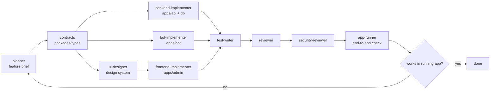

# AGENTS.md - Codex multi-agent workflow

BeoSand ships a Codex operating layer under `.codex/`. For anything larger than a one-file change,
run the heavier flow below instead of editing ad hoc. The same guidance applies whether the main
agent or a delegated subagent does the work.

Hard rule: once the planner or feature-planning flow is engaged, the main agent does not implement
code, tests, migrations, UI, docs, or cleanup directly. The planner/main agent only orchestrates,
reviews, verifies, and commits; every file change is delegated to the smallest appropriate role
subagent.

Older operating-layer mirrors may still exist, but Codex should prefer `.codex/agents`,
`.codex/skills`, and `.codex/rules` whenever multiple versions are present.

## Model routing

- Use the frontier model for all analysis, review, planning, and research tasks.
- Use `5.3-codex` for writing code, writing tests, and running the application.

## Roles (`.codex/agents/*.toml`)

| Agent | Responsibility |
| --- | --- |
| `planner` | Clarify scope, pick the smallest correct slice, write the feature brief. Delegates; does not implement. |
| `backend-implementer` | `apps/api` modules + `packages/types` contracts + `packages/db` schema/migrations. |
| `bot-implementer` | `apps/bot` flows/keyboards calling the API. No domain logic in the bot. |
| `ui-designer` | Visual/UX quality of `apps/admin`: design system, typography, layout, components, accessibility. |
| `frontend-implementer` | `apps/admin` (React+Vite) screens calling the API. No domain logic in the frontend. |
| `test-writer` | Vitest unit/integration tests for the changed behavior. |
| `reviewer` | Correctness + invariant review of the diff. |
| `security-reviewer` | Authz (`telegram_id` ownership/role), input validation, secrets, money/availability integrity. |
| `app-runner` | Run API + bot (and DB) and confirm the feature actually works end to end. |

## Flow

1. **Plan.** `planner` reads the spec slice plus `docs/architecture/*`, clarifies open questions,
   and writes or updates `docs/product/features/<slug>.md` with goal, contracts/tables touched, API
   endpoints, bot flow, acceptance criteria, tests, and dependencies.
2. **Contracts first.** Add or adjust Zod contracts in `packages/types` and any schema in
   `packages/db` with a generated migration before wiring services. Contracts are the source of
   truth.
3. **Implement.** Backend, bot, and frontend work can run in parallel against agreed contracts.
   Backend owns domain decisions, recompute, money, and availability. Bot and admin only render and
   call the API.
4. **Test.** Cover valid input, invalid input, unsafe or forbidden cases, and the invariant touched
   by the feature, such as capacity recompute, status flip, monthly batch, single-date cancel, or
   six-per-hour limits.
5. **Review -> security review.** Run correctness, cleanliness, and invariant review first, then
   security review for authorization, validation, secrets, and money/availability integrity.
6. **Run.** `app-runner` boots the stack and exercises the flow. A feature is done only when it works
   in the running bot/API/admin, or when a concrete blocker and next owner are documented.

## Definition of done

- `pnpm typecheck && pnpm lint && pnpm test && pnpm build` is green across all workspaces,
  including `@beosand/admin`.
- Behavior is verified in the running app, or a precise blocker is documented.
- Superseded code is removed; any remaining legacy path is named in the summary.
- The feature brief's acceptance criteria are all met.
