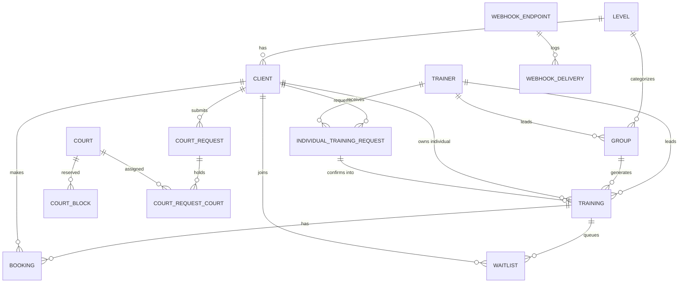

# Domain model

This document mirrors the current code at a practical level. The physical schema lives in
`packages/db/src/schema.ts`; contracts and pure helpers live in `packages/types/src`.

## Training and booking

- **Level** - reference data for client and group difficulty.
- **Trainer** - staff member with optional Telegram identity, locale, status, individual visibility,
  and calendar feed version.
- **Manager** - editable admin record. Admin access is the union of `ADMIN_TELEGRAM_IDS` and active
  manager rows with a known `telegramId`.
- **Client** - Telegram or walk-in client. Telegram ID is nullable for walk-ins; username, photo,
  phone, email, note, language, consent timestamp, and bonus credits are optional/supporting data.
- **Group** - recurring slot: level, weekdays, time, trainer, home court, capacity, prices, visibility,
  and status.
- **Training** - dated group or individual session. Group sessions point to `groupId`; individual
  sessions point to the owning `clientId` and can carry a per-session price.
- **Booking** - client participation in a training: single/group type, status, source, payment status,
  and optional monthly subscription id.
- **Waitlist** - ordered queue per training, including monthly-subscription entries.
- **IndividualTrainingRequest** - durable client request for a trainer/date/time. Confirmation creates
  and links the final training.

## Courts

- **Court** - active/inactive physical court number.
- **CourtBlock** - manual admin block or generated block tied to a group training.
- **CourtRequest** - client rental request with date/time, duration, requested court count, price,
  status, and decision metadata.
- **CourtRequestCourt** - join table for held or assigned courts; this is the source for multi-court
  request occupancy.

## Communication and operations

- **Notification** and **NotificationTemplate** - send log and localized editable message bodies.
- **Broadcast** - broadcast run record.
- **UiLabel** - localized UI label override over the static `packages/i18n` catalog.
- **WebhookEndpoint** and **WebhookDelivery** - signed outbound webhooks, retries, and delivery history.
- **AppSetting** - operational key/value settings.

## Helper invariants

Important pure rules live in `packages/types/src/helpers.ts`: training status recompute, free-seat and
bookability checks, month date generation, court grid math, price helpers, and narrowed participant
visibility shapes.
