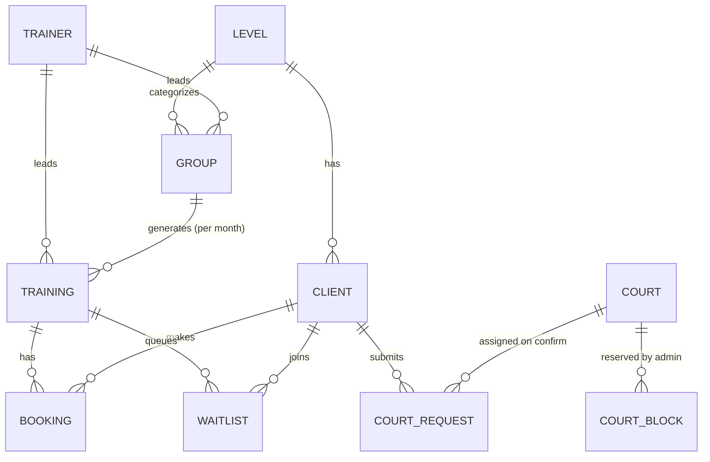

# Domain model

Mandatory backbone (spec section 18): **Group → Trainings → Bookings**. Everything about monthly
booking, concrete dates, free slots, and analytics depends on it.

## Training domain

- **Level** — reference (Beginner/Intermediate/Advanced).
- **Trainer** — reference; `type` main|guest; optional `telegramId` for the trainer UI.
- **Client** — a Telegram user. Identity = `telegramId` (numeric); `telegramUsername` optional. Has a
  `levelId`. No phone number (spec 3.1).
- **Group** — a recurring slot: level, weekdays, start/end time, trainer, capacity, single price,
  monthly price (RSD).
- **Training** — a concrete dated instance of a group: date, times, trainer, capacity, `bookedCount`,
  status `open|full|cancelled|completed`. Generated for a chosen month from the group's weekdays.
- **Booking** — a client on a training: `type` single|group, `status`
  `booked|cancelled|attended|no_show|waitlist`, `source=telegram`. Monthly subscriptions share a
  `groupSubscriptionId` so a month can be created as a batch and one date cancelled independently.
- **Waitlist** — ordered queue per full training; on a cancellation the head is notified and promoted.

## Court domain (Edition 2)

- **Court** — one of 6 physical courts. Clients never see/choose them.
- **CourtBlock** — admin reservation of a court for a time range (training/tournament/repair).
- **CourtRequest** — a client's request for a *time* + duration (1 or 2 h) with a server-computed RSD
  price. `status` `pending|confirmed|rejected|cancelled`; `courtId` is set only on admin confirmation.

## Key derived rules (pure helpers in `packages/types/src/helpers.ts`)

- `recomputeTrainingStatus` — `open ↔ full` by capacity; `cancelled`/`completed` are terminal.
- `freeSeats` / `isBookable` — what a client may book (status `open` + seats > 0).
- `monthTrainingDates(days, year, month)` — dates to generate for a group's month.
- `courtPriceRsd(hours)` / `courtHoursCovered(start, hours)` — pricing and the hours a court booking
  occupies (used for the 6-per-hour limit).
