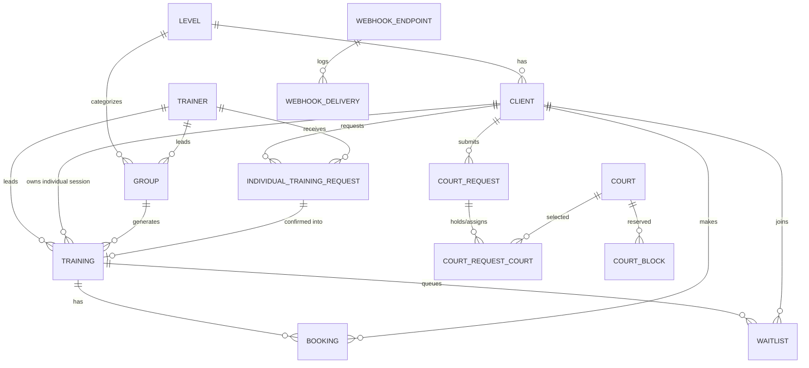

# Domain model

This document mirrors the current code. The physical schema lives in
`packages/db/src/schema.ts`; contracts and pure helpers live in `packages/types/src`.

## Training domain

- **Level** - reference data for client/group/training difficulty.
- **Trainer** - reference and actor data. Carries `telegramId`, `telegramUsername`, `language`,
  `status`, and `individualVisible`.
- **Manager** - editable admin/manager records. Authorization is the union of env
  `ADMIN_TELEGRAM_IDS` and active manager rows with a known `telegramId`.
- **Client** - Telegram or walk-in user. Identity is numeric `telegramId` when present; username and
  photo URL are optional display/contact fields.
- **Group** - recurring training slot: level, weekdays, time range, trainer, home court, capacity,
  prices, visibility, and status.
- **Training** - dated instance. Group trainings point to `groupId`; individual sessions point to
  `clientId` and can carry per-session `priceSingleRsd`. Status is `open|full|cancelled|completed`.
- **Booking** - a client on a training. Supports `single|group`, `booked|pending|cancelled|attended|
  no_show|waitlist`, payment status, and optional `groupSubscriptionId`.
- **Waitlist** - ordered queue per training; used by client booking flows and admin promotion/swap
  tools.
- **IndividualTrainingRequest** - durable request for a trainer/date/time. Pending requests are sent
  to the trainer/admin path; confirmation creates the actual training and booking.

## Court domain

- **Court** - one of the physical courts; clients do not choose court ids directly in the booking UI.
- **CourtBlock** - admin reservation for a court/date/time range.
- **CourtRequest** - client's court rental request: date, time range, requested court count, price,
  status, and decision metadata.
- **CourtRequestCourt** - join table for held/assigned courts. This is the current model; the older
  single `court_requests.court_id` shape is superseded.

## Communications and operations

- **Notification** - outbound send log for Telegram/channel sends.
- **NotificationTemplate** - editable localized message templates for supported event keys.
- **Broadcast** - free-slot or operational broadcast record.
- **UiLabel** - editable localized UI labels.
- **AppSetting** - key/value operational settings such as manager contact and detailed request
  logging.
- **WebhookEndpoint / WebhookDelivery** - outbound webhook configuration, signed delivery payloads,
  retry state, and delivery history.

## Pure helper rules

Important invariants are implemented and tested in `packages/types/src/helpers.ts`:

- Training status recompute: `open <-> full` by capacity; terminal statuses stay terminal.
- Bookability and free seats: client-facing booking only sees bookable slots.
- Month date generation for group schedules.
- Court price/time coverage and free-court grid math.
- Narrowed roster/member rows for client-facing participant and waitlist visibility.
