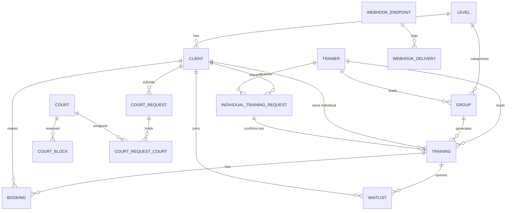

# Domain model

This document mirrors the current code at a practical level. The physical schema lives in
`packages/db/src/schema.ts`; contracts and pure helpers live in `packages/types/src`.

```mermaid
erDiagram
  LEVEL ||--o{ CLIENT : "has"
  LEVEL ||--o{ GROUP : "categorizes"
  TRAINER ||--o{ GROUP : "leads"
  TRAINER ||--o{ TRAINING : "leads"
  GROUP ||--o{ TRAINING : "generates"
  CLIENT ||--o{ TRAINING : "owns individual"
  TRAINING ||--o{ BOOKING : "has"
  CLIENT ||--o{ BOOKING : "makes"
  TRAINING ||--o{ WAITLIST : "queues"
  CLIENT ||--o{ WAITLIST : "joins"
  CLIENT ||--o{ INDIVIDUAL_TRAINING_REQUEST : "requests"
  TRAINER ||--o{ INDIVIDUAL_TRAINING_REQUEST : "receives"
  INDIVIDUAL_TRAINING_REQUEST ||--o| TRAINING : "confirms into"
  COURT ||--o{ COURT_BLOCK : "reserved"
  CLIENT ||--o{ COURT_REQUEST : "submits"
  COURT_REQUEST ||--o{ COURT_REQUEST_COURT : "holds"
  COURT ||--o{ COURT_REQUEST_COURT : "assigned"
  WEBHOOK_ENDPOINT ||--o{ WEBHOOK_DELIVERY : "logs"
```

## Training and booking

- **Level** - reference data for client and group difficulty.
- **Trainer** - staff member with optional Telegram identity, locale, status, individual visibility,
  and calendar feed version.
- **Manager** - editable admin record. Admin access is the union of `ADMIN_TELEGRAM_IDS` and active
  manager rows with a known `telegramId`.
- **Client** - Telegram or walk-in client. Telegram ID is nullable for walk-ins; username, photo,
  phone, email, note, language, consent timestamp, bonus credits, and a `gender` value are
  optional/supporting data. Gender is one of `male`, `female`, or `unspecified`; it is collected
  only through verified Mini App onboarding and is never inferred. Existing clients and legacy bot
  onboarding retain/use `unspecified`. For a first Mini App registration, the client row, selected
  gender, server-stamped consent time, and Mini App access time are created atomically.
- **Group** - recurring slot: level, weekdays, time, trainer, home court, capacity, prices, visibility,
  and status.
- **Training** - dated group or individual session. Group sessions point to `groupId`; individual
  sessions point to the owning `clientId` and can carry a per-session price.
- **Booking** - client participation in a training: single/group type, status, source, payment status,
  and optional monthly subscription id.
- **Waitlist** - ordered queue per training, including monthly-subscription entries.
- **IndividualTrainingRequest** - durable client request for a trainer/date/time. Confirmation creates
  and links the final training.

## Courts

- **Court** - active/inactive physical court number.
- **CourtBlock** - manual admin block or generated block tied to a group training.
- **CourtRequest** - client rental request with date/time, duration, requested court count, price,
  status, and decision metadata.
- **CourtRequestCourt** - join table for held or assigned courts; this is the source for multi-court
  request occupancy.

## Communication and operations

- **Notification** and **NotificationTemplate** - send log and localized editable message bodies.
- **Broadcast** - broadcast run record.
- **BroadcastAutomation** - versioned definition for a scheduled or event-triggered broadcast.
  Its audience is a JSON object with a `filters` array of one to three distinct dimensions:
  `{ dimension: "level", levelIds: [...] }`, `{ dimension: "activity", value: "active" | "inactive" }`,
  and/or `{ dimension: "gender", value: "male" | "female" | "unspecified" }`. Selected
  dimensions combine with AND; multiple level IDs combine within the level dimension. Every run
  keeps a configuration snapshot for audit and retry behavior.
- **UiLabel** - localized UI label override over the static `packages/i18n` catalog.
- **WebhookEndpoint** and **WebhookDelivery** - signed outbound webhooks, retries, and delivery history.
- **AppSetting** - operational key/value settings.

## Helper invariants

Important pure rules live in `packages/types/src/helpers.ts`: training status recompute, free-seat and
bookability checks, month date generation, court grid math, price helpers, and narrowed participant
visibility shapes.

Broadcast-automation audience selection is also an API invariant: recipients must be active clients
with a Telegram ID, then satisfy every selected audience dimension. A `male` or `female` gender
filter also includes clients whose stored gender is `unspecified`; an `unspecified` filter is exact.
The preview calculates recipients using that current predicate. Delivery and retry re-check the same
predicate for each claimed recipient immediately before a Telegram send, so a changed client state is
recorded as `audience-no-longer-eligible` rather than sent from a stale audience.
