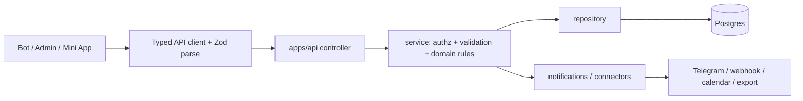

# Architecture overview

BeoSand is a Telegram-first booking system for a beach-volleyball school. It now has three user
surfaces over one API and one database:

1. **Telegram bot** - client, trainer, and manager interactions in Telegram.
2. **Admin console** - browser UI for managers/admins.
3. **Telegram Mini App** - richer client booking and calendar surface inside Telegram.

The API is the domain source of truth. UI apps render, collect input, call typed API clients, and
validate responses with shared Zod contracts; they do not compute money, capacity, or availability.

## Components

```text
apps/bot       grammY Telegram bot. Menus/keyboards/callback routing; calls apps/api through a typed
               ApiClient. No database writes and no domain math.

apps/api       NestJS modular monolith. Controller -> service -> repository. Owns authorization,
               validation orchestration, transactions, capacity/availability recompute, notification
               dispatch, scheduled work, connectors, and settings.

apps/admin     React + Vite admin console. Authenticated manager/admin browser surface for schedule,
               rosters, courts, broadcasts, analytics, labels, notification templates, connectors, and
               operational settings.

apps/miniapp   React + Vite Telegram Mini App. Client surface for home, unified calendar, booking,
               group subscription, individual request, court request, my bookings, and profile.

packages/types Shared Zod contracts and pure helpers used by api, bot, admin, and miniapp.

packages/db    Drizzle schema, migrations, seed, and local Postgres compose. The schema is the single
               structural source of truth.

packages/i18n  RU/SR/EN static catalogs used as bundled fallbacks by bot/admin/miniapp.

packages/config Shared TypeScript and environment-contract support.
```

## API modules

`apps/api/src/app.module.ts` currently wires these domain modules:

`analytics`, `auth`, `bookings`, `broadcasts`, `clients`, `connectors`, `court-requests`, `courts`,
`groups`, `i18n`, `levels`, `managers`, `notification-templates`, `notifications`, `settings`,
`subscriptions`, `trainers`, `trainings`, and `waitlist`.

The API also installs the global `RequestLoggingInterceptor`, backed by `SettingsService`.

## Request flow



## Core invariants

- Numeric `telegramId` is identity for Telegram users; usernames and photos are display/contact data.
- Contracts live in `packages/types`; UI clients validate rendered data against them.
- Schema lives in `packages/db`; repositories are the only DB access layer.
- Capacity, waitlist promotion, court availability, prices, and individual-request decisions are API
  service responsibilities.
- Client-facing roster/member shapes are narrowed before render; they do not expose another client's
  id or full name.
- Secrets stay server-side. Bot token, connector secrets, webhook signing secrets, and service-account
  material are never returned to UI apps.

See `domain-model.md` for entities and `database.md` for the physical schema.
