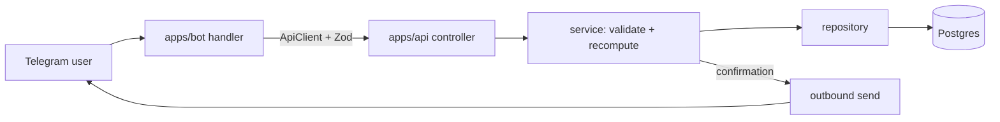

# Architecture overview

BeoSand is a Telegram booking system for a beach-volleyball school in Belgrade. It serves **two
domains in one bot**:

1. **Training booking** — clients book school training sessions (single or a whole month of a group),
   trainers see their day, managers run the schedule and broadcasts.
2. **Court rental (Edition 2)** — clients request a *time* to rent a court; the admin manually
   assigns one of the 6 courts and confirms. Money in RSD.

## Components

```
apps/bot   grammY Telegram bot — the only user touchpoint. Renders menus/keyboards, routes taps,
           calls apps/api. No domain logic.
apps/api   NestJS modular monolith (:3000) — domain source of truth. One module per domain;
           controller → service → repository. Hosts the scheduler (reminders, waitlist) and sends
           outbound Telegram messages (notifications, broadcasts).
packages/types   Zod contracts + pure domain helpers shared by api and bot.
packages/db      Drizzle schema + migrations + Postgres compose. Only place the schema lives.
packages/config  Shared tsconfig + fail-closed env contract.
```

## Request flow (booking example)



The bot is an interaction layer; the API decides. The bot never writes to the database and never
computes price or availability.

## Why this shape

- **Two apps, shared packages** keeps the bot thin and the domain testable in isolation, and leaves
  room for a future web admin without touching domain code.
- **Contracts in one place** (`packages/types`) means the bot and API can't drift.
- **Schema in one place** (`packages/db`) with generated migrations keeps the DB the single source of
  structural truth.

See `domain-model.md` for entities and `database.md` for the physical schema. The build/run commands
and invariants live in `CLAUDE.md`; the multi-agent workflow in `AGENTS.md`.
