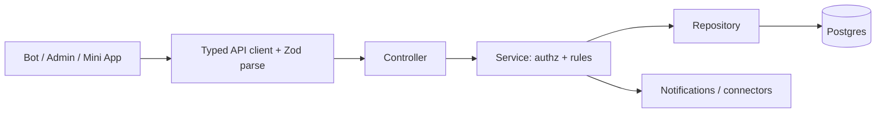

# Architecture overview

BeoSand is a Telegram-first booking system for a beach-volleyball school. One API and one Postgres
database serve three product surfaces:

1. **Telegram bot** - client, trainer, and manager interactions in Telegram.
2. **Admin console** - browser UI for managers/admins.
3. **Telegram Mini App** - richer client booking, calendar, request, and profile surface in Telegram.

The API is the domain source of truth. UI apps render state, collect input, call typed API clients,
and validate responses with shared Zod contracts; they do not compute money, capacity, or availability.

## Components

```text
apps/api       NestJS modular monolith. Owns auth, validation orchestration, transactions,
               recompute, notifications, settings, and external connectors.
apps/bot       grammY long-polling Telegram bot. Calls the API through a typed ApiClient.
apps/admin     React + Vite admin console for schedule, rosters, courts, broadcasts, analytics,
               labels, notification templates, connectors, and settings.
apps/miniapp   React + Vite Telegram Mini App for home, calendar, group/individual/court requests,
               my bookings, and profile.
packages/types Shared Zod contracts and pure helpers used by every app.
packages/db    Drizzle schema, migrations, seed, and local Postgres compose.
packages/i18n  RU/SR/EN static catalogs, overlaid by editable API label rows.
packages/config Shared environment contract and admin identity helpers.
```

## API modules

`apps/api/src/app.module.ts` wires: `analytics`, `auth`, `bookings`, `broadcasts`, `clients`,
`connectors`, `court-requests`, `courts`, `groups`, `i18n`, `levels`, `managers`,
`notification-templates`, `notifications`, `settings`, `subscriptions`, `trainers`, `trainings`, and
`waitlist`. The API also installs request logging through a global interceptor.

## Request flow



## Core invariants

- Numeric `telegramId` is Telegram identity; username and photo are display/contact data.
- Contracts live in `packages/types`; browser/bot clients parse API responses against them.
- Schema lives in `packages/db`; repositories are the DB access layer.
- Capacity, waitlist, court availability, prices, payment status, and request decisions belong to API
  services.
- Client-facing roster/member shapes are narrowed before render.
- Secrets stay server-side. Browser bundles receive only `VITE_*` public values.

See [domain-model.md](domain-model.md) and [database.md](database.md) for the current data model.
