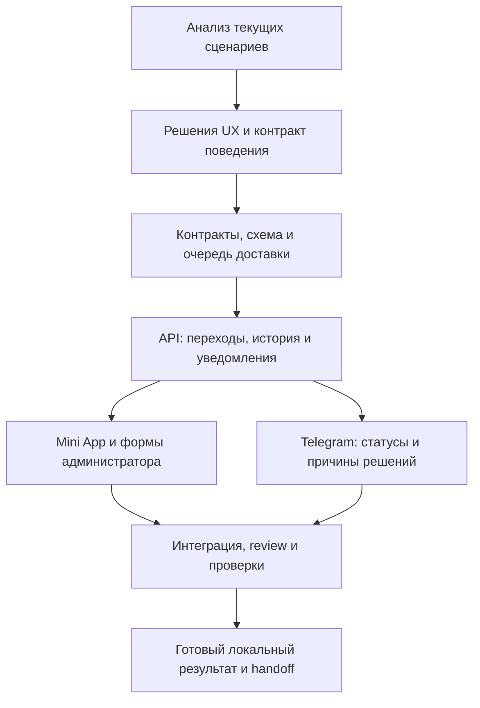

# Прозрачные статусы записей и заявок

Дата: 2026-09-23. Workflow: `booking-status-transparency`, revision 1.
Режим: **Graph**, выбран пользователем. Состояние: `running`.
Реализация и создание pull request разрешены пользователем 2026-09-23.
Рабочая ветка: `codex/booking-status-transparency`, база `origin/main` (`23412b4`).

## Цель и решения пользователя

После действия клиент понимает, сохранена ли его заявка, подтверждено ли место,
нужно ли ждать решения и что произошло при отказе или отмене. Состояние доступно
при повторном открытии приложения; уведомление в Telegram сообщает о переходе.

Подтверждено пользователем:

- Единый раздел **«Мои записи и заявки»**: тренировки, аренда кортов,
  индивидуальные заявки и лист ожидания.
- Отказы и отмены остаются в истории.
- После создания заявки уведомляется не только администратор, но и сам
  пользователь: отдельное личное сообщение в Telegram подтверждает, что заявка
  заведена, и сообщает её текущий статус. Это обязательное требование для заявок
  как из Mini App, так и из бота.
- Зависимости реализации фиксируются заранее в Graph Spec.

Рабочее решение после разрешения начать реализацию:

- Обязательная причина решения сотрудника: выбор причины + необязательный
  комментарий до 500 символов. Применяется рекомендованный вариант; отдельного
  ответа о формате причины пользователь не дал. Коды: `unavailable`,
  `schedule-change`, `staff-unavailable`, `other`; для `other` комментарий обязателен.

## Основание: текущее приложение

Источник фактов — текущие исходники, не проверка работающего production.
Таблица ниже фиксирует первоначальный аудит локального main. Перед реализацией
получен актуальный `origin/main`: PR #71 уже добавил аренды и их историю в общий
список Mini App; PR #73 добавил operational-period planner. Реализация опирается
на эти изменения, сохраняет отдельный календарный feed и расширяет историю
индивидуальными заявками и точными исходами действий.
Архитектура: [overview](../../architecture/overview.md),
[domain model](../../architecture/domain-model.md),
[database](../../architecture/database.md).

| Сценарий | Что уже реализовано | Пробел |
| --- | --- | --- |
| Создание аренды | Сохраняется `pending`; администраторы получают сообщение | Клиенту API не отправляет отдельное подтверждение получения заявки |
| Решение по аренде | `confirmed`/`rejected`, клиентские сообщения | В контракте отказа нет причины |
| Отмена аренды | Администратор переводит `confirmed` → `cancelled` | Нет клиентского уведомления; отменённая аренда исключается из клиентского списка |
| Обычная запись на тренировку | Создаётся `booked`, отправляется подтверждение | Нельзя искусственно показывать ожидание: решение здесь автоматическое |
| Отказ по ожидающей записи | Есть решение и уведомление | Отказ сохраняется как `cancelled`; нет причины и различия с самостоятельной отменой |
| Отмена записи/тренировки | Освобождение места и отмена занятия уже существуют; для отмены занятия есть уведомления | Отменённые записи и занятия исключаются из клиентского списка |
| Индивидуальная заявка | Durable `pending`, решение создаёт тренировку или `declined`; подтверждение уведомляет клиента | Нет клиентского списка ожидающих/отклонённых заявок; при создании и отказе нет соответствующих клиентских уведомлений |
| Лист ожидания | Очередь и автоматическое продвижение с уведомлением | Добавление в очередь само по себе не отправляет клиентское уведомление в изученных путях |
| Telegram «Мои записи» | Список тренировок и отмена | Строка предстоящей записи не выводит статус; нет единой истории разных видов заявок |
| Надёжность уведомлений | Есть журнал отправок, локализация, dispatcher, scheduler напоминаний | Для перечисленных переходов нет общей transactional outbox; scheduler напоминаний не повторяет потерянные решения |

Ключевые места:

- `apps/api/src/modules/court-requests/court-requests.service.ts`: `createRequest`,
  `notifyAdminsOfNewRequest`, `notifyDecision`, `cancelRequest`.
- `apps/api/src/modules/court-requests/court-requests.repository.ts`:
  `listMineForClient` исключает `cancelled`.
- `apps/api/src/modules/bookings/bookings.service.ts`: `createSingle`,
  `createGroup`, `cancelBooking`, `declineBooking`, `declineSubscription`.
- `apps/api/src/modules/bookings/bookings.repository.ts`: `listForClient`
  исключает отменённые брони и отменённые тренировки.
- `apps/api/src/modules/trainers/trainers.service.ts`: `requestIndividual`,
  `confirmIndividualRequest`, `declineIndividualRequest`.
- `apps/api/src/modules/waitlist/waitlist.service.ts`: создание, отмена и продвижение очереди.
- `apps/api/src/modules/notifications/notifications.service.ts`,
  `notifications.scheduler.ts`: отправка и текущие границы повторов.
- `apps/miniapp/src/screens/MyBookingsScreen.tsx`, `CalendarScreen.tsx`,
  `TrainerRequestScreen.tsx`, `ui/BookingItemCard.tsx`.
- `apps/bot/src/my-bookings.ts`: `formatUpcomingLine`.

## Контракт поведения

| Пользовательский статус | Значение | Что делать клиенту |
| --- | --- | --- |
| Заявка получена — ожидает подтверждения | Заявка сохранена, сотрудник ещё не принял решение | Ждать решения; повторно подавать заявку не нужно |
| Запись / аренда подтверждена | Место или аренда подтверждены сервером | Проверить дату, время и подтверждённые детали |
| В листе ожидания | Подтверждённого места нет | Ждать; показывать актуальную позицию, если она доступна |
| Заявка отклонена | Сотрудник отказал | Прочитать причину, выбрать другой вариант |
| Отменено вами | Клиент отменил свою запись | Запись больше не действует |
| Отменено организатором | Сотрудник отменил запись/аренду/занятие | Прочитать причину, выбрать другой вариант |
| Завершено / посещено / пропуск | Событие прошло; посещение показывается только при наличии данных | Доступно в истории |

Правила:

1. API — источник статуса, причин, доступных действий и классификации в активное/историю.
   Mini App и бот не принимают решения о вместимости, деньгах и подтверждении.
2. Сохранённая заявка и доставленное уведомление — разные факты. Ответ Telegram
   не подтверждает бронирование. `delivered: true` у индивидуальной заявки означает
   доставку сотруднику, а не согласие тренера; fallback администратору нельзя
   описывать как «тренер получил запрос».
3. Отказ, собственная отмена и отмена сотрудником различимы для новых операций.
   Историческим строкам без метаданных не приписывается выдуманная причина/автор.
4. Карточка показывает вид, дату/время, статус, подтверждённые детали, причину
   при наличии и следующий шаг. Цвет дополняет текст, но не заменяет его.
5. У списка есть активные элементы и история. Отмена не удаляет историю и не
   возвращает элемент в доступные для посещения события календаря.
6. После подтверждения индивидуальной заявки клиент видит одну актуальную
   запись, связанную с исходной заявкой, без двух конкурирующих карточек.
7. Месячная запись сообщает отдельно подтверждённые даты, очередь и пропущенные
   даты. Один пакетный результат не маскирует частичный успех словом «готово».
8. Ошибка валидации/конфликт до сохранения показывает, что заявка не создана.
   При тайм-ауте с неизвестным результатом сначала проверяется серверное состояние;
   UI не утверждает ни успех, ни отказ и не создаёт дубликат вслепую.
9. Терминальные решения сотрудника требуют причины из списка и комментария для `other`.
   Самостоятельная отмена клиентом не требует объяснения.
10. Текущие правила автоматического подтверждения, оплаты, очереди и удержания
    кортов сохраняются. «Ожидает подтверждения» не означает одинаковый механизм
    удержания для старого bot-пути аренды и Mini App с выбранными кортами.

## Уведомления и история

### Подтверждение создания заявки — обоим получателям

После успешного сохранения заявки на аренду или индивидуальную тренировку
пользователь получает личное уведомление в Telegram о создании заявки.
Уведомление администратору сохраняется; для индивидуальных тренировок сохраняется
существующая маршрутизация сотруднику: тренер, затем администратор при недоступности.
Клиентское сообщение отправляется независимо от успешности доставки сотруднику.
Экран результата в Mini App не заменяет личного уведомления в Telegram.

Пример клиентского сообщения для ожидающей заявки:

> Ваша заявка на аренду корта на 25 сентября, 18:00–19:00, получена.
> Статус: ожидает подтверждения администратора. О решении сообщим здесь.

Сообщение отражает фактический статус: получение ожидающей заявки не называется
подтверждённой бронью; для автоматически подтверждаемой записи сразу сообщается
«Запись подтверждена». До сохранения заявки уведомление об её создании не отправляется.
Доставка и повторы учитываются отдельно по получателям: ошибка отправки клиенту
не отменяет заявку и не требует повторно уведомлять уже получившего сообщение
администратора, и наоборот. Ответ бота и серверное уведомление согласуются так,
чтобы одно создание не давало клиенту два одинаковых подтверждения получения.

### Остальные переходы и надёжность

События в объёме фичи: создание заявки; подтверждение; отказ; отмена клиентом;
отмена сотрудником/занятия; вступление и выход из очереди; продвижение из очереди;
результат месячной записи и переноса группы. Повтор того же запроса без нового
перехода не создаёт нового события. Повторная запись после отмены — новое действие
и должна получить собственное подтверждение.

Уведомление содержит вид действия, дату/время, результат, причину решения при
наличии и понятный следующий шаг. Оно не утверждает, что сообщение прочитано.
Интерфейс в приложении обновляется после действия и при возврате на экран;
ожидающие заявки обновляются без необходимости перезапускать приложение.

Рекомендуемая техническая граница: событие изменения и задание на Telegram
сохраняются в той же транзакции, что и доменная операция. Отправка выполняется
после commit. Worker повторяет временные сбои с ограничениями и хранит результат.
Недоступный Telegram не отменяет запись. Для отсутствующего Telegram у walk-in
клиента не создаётся бесконечный цикл отправки. При окончательной ошибке сотрудник
видит недоставленное уведомление; клиент всё равно видит состояние в приложении.

Дедупликация — по конкретному переходу/операции и получателю, не только по
`clientId + trainingId + type`. Отправки одного объекта обрабатываются в порядке
событий. Telegram не даёт приложению атомарной транзакции с Postgres: сбой после
принятия сообщения Telegram, но до записи результата может дать повтор. Обещать
exactly-once или гарантированное прочтение нельзя.

## Границы реализации

- Новые/расширенные общие контракты: клиентская запись/заявка, причина решения,
  текущий статус, связь индивидуальной заявки с записью, серверная пагинация истории.
- Хранилище: метаданные решений; события переходов и задания доставки с индексами
  идемпотентности/очереди. Одна согласованная миграция, без генерации разными авторами.
- API: клиентский read endpoint единого списка с проверкой владельца и ограниченной
  пагинацией; расширение существующих команд отказа/отмены; события внутри транзакций.
- Новые чтения истории отделены от существующей семантики календаря. Не просто
  убрать все фильтры `cancelled` из общих запросов.
- Поверхности: Mini App, бот, формы решений администратора/тренера, RU/SR/EN.
- Изменение расписания без изменения участия, напоминания, рассылки, платежи,
  новые каналы доставки и новые способы отмены аренды не входят в эту фичу.
- Новые deep links и переходы во внешние приложения не добавляются без выбора UX.
- Старые статусы доступны по исходным данным, но журнал переходов не выдумывается
  задним числом и старым клиентам не рассылаются массовые уведомления о прошлом.

## Graph Spec v1

Цель завершения: все описанные сценарии доступны в едином списке, новые решения
сохраняют причину, переходы ставят уведомления в durable очередь, проверки ниже
пройдены. Production rollout — отдельное защищённое действие.

| ID | Владелец / вход | Действие и свидетельство | Состояние |
| --- | --- | --- | --- |
| A | root; запрос, текущий код | Анализ сценариев и конкретных пробелов, таблица выше | succeeded |
| B | root; A, решения пользователя | Зафиксировать формат причины, критерии и точные интерфейсы | succeeded |
| C | backend-implementer; B | `packages/types`, `packages/db`, модуль доставки; миграция, контракты, проверки очереди | succeeded |
| D | backend-implementer; C | API чтения и все перечисленные переходы; тесты транзакций, авторизации, причин и дедупликации | succeeded |
| E | frontend-implementer / worker Mini App; D | Единый список, история, результаты действий; формы причин; UI-тесты и визуальная проверка | succeeded |
| F | bot-implementer; D | Статусы списка, история, сбор причины, актуальные ответы; тесты callback и API client | succeeded |
| G | root + выбранные проверяющие; E и F | Интеграция, correctness/security review, полный набор проверок, runtime-сценарии | succeeded |
| H | root; G | Итог, результаты проверок, миграция/rollout handoff, ограничения | running |

Правила графа:

- Ребро разрешает выполнение только при `succeeded` предшественника и наличии
  его артефактов. Разрешение начать реализацию закрывает B с рабочим решением выше.
- E/F могут выполняться параллельно только с непересекающимся владением;
  общие i18n-файлы и изменения общих контрактов передаются одному владельцу.
- Join G требует завершения обоих E/F и их проверок. H требует завершения G.
- Ошибка проверки возвращается владельцу соответствующего узла; максимум две
  попытки исправления на одну диагностированную причину, затем root фиксирует
  блокер и согласует изменение графа, если меняются зависимости/границы.
- Изменение области, зависимостей, join, recovery или критерия завершения создаёт
  новую ревизию графа и требует подтверждения пользователя перед выполнением.
- Миграция production, deploy и реальные сообщения клиентам требуют отдельного
  разрешения с конкретной целью. Локальная реализация, изолированные тесты,
  commit/push рабочей ветки и ready-for-review pull request входят в запрос.
- Не трогать существующие несвязанные изменения: `packages/types/src/helpers.ts`
  и `.pnpm-store/v11/projects/`, обнаруженные перед работой.

## Приёмка и проверки

1. Создать аренду из Mini App и бота: после успешного ответа есть `pending`
   в едином списке и задания уведомления **и администраторам, и самому клиенту**.
   С тестовым Telegram transport оба получателя получают соответствующие сообщения;
   клиент видит «Заявка получена — ожидает подтверждения», дату и время.
   Закрытие/повторное открытие не теряет заявку. При отклонённом до сохранения
   запросе сообщения о создании нет. Сбой доставки одному получателю не блокирует
   другого и не вызывает повторов уже успешно доставленного сообщения.
2. Подтвердить, отклонить, отменить аренду: статус и причина согласованы между
   API, приложением и сообщением; отмена освобождает корт и остаётся в истории.
3. Обычная запись сразу показывает подтверждение. При полном занятии клиент
   видит очередь без утверждения, что место уже занято для него.
4. Индивидуальная заявка видна до решения и после отказа. При создании клиент
   получает собственное уведомление «Заявка получена — ожидает подтверждения»
   независимо от доставки тренеру/администратору. Подтверждение создаёт ровно одну
   тренировку/запись; fallback доставки сотруднику не вводит в заблуждение.
5. Отказ сотрудника отличается от отмены клиентом. Пустая причина решения
   сотрудника отвергается. Старые неизвестные причины отображаются честно.
6. Месячная запись/перенос корректно отражают даты в записи и очереди;
   отмена одного дня не меняет соседние даты.
7. Недоступность Telegram не меняет доменный результат; рестарт worker и
   временный сбой не теряют сохранённое задание. Проверить конкурирующие workers,
   исчерпание retry, отсутствие канала и порядок сообщений одного объекта.
8. Повторное нажатие/конкурирующее решение не создаёт двойную запись или двойное
   событие. Новая запись после отмены не подавляется старым ключом дедупликации.
9. Чужие заявки, причины и история недоступны клиенту. Решение тренера ограничено
   его областью. Текст причины безопасно отображается, включая Telegram HTML.
10. История имеет пагинацию; терминальные объекты не считаются активными и не
    получают действующих кнопок отмены/подтверждения.
11. `pnpm typecheck`, `pnpm lint`, `pnpm test`, `pnpm build` по всем workspace,
    включая admin. Точечные тесты контрактов, API, bot и Mini App дополняют это.
12. Runtime-проверка с локальной БД и тестовым Telegram transport; не отправлять
    реальные сообщения. Если среда недоступна, записать конкретный блокер и
    владельца следующей проверки, не заявляя runtime-подтверждение.

## Текущее свидетельство выполнения

- Прочитаны исходники перечисленных сценариев и архитектурные документы.
- Создана изолированная рабочая копия, обновлённая до актуального main.
- Зависимости установлены с frozen lockfile. Docker доступен для локальной проверки.
- C завершён: общие контракты и transactional outbox, bounded retry и ambiguous outcome.
  Точечные проверки: types build; 264 теста контрактов; 13 тестов модуля доставки;
  lint модуля; 19 тестов пакета БД. Все прошли.
- Миграция `0037_productive_wolfpack.sql` добавляет только event/delivery объекты.
  Восстановлен snapshot 0036 по текущему main без изменения ранее применённых SQL.
  Миграция и её повтор успешно выполнены в отдельной локальной БД на порту 55439.
- D завершён. API typecheck и lint прошли; точечные доменные проверки записей,
  очереди, отмен и NotificationsService прошли (540 тестов), проверены аренда,
  индивидуальные заявки, клиентская история и общие контракты.
  На изолированной PostgreSQL прошли 9 интеграционных тестов:
  откат транзакции, конкурентная дедупликация, конкурентный claim и порядок,
  продолжение после ambiguous, повтор известного сбоя и окончательная ошибка.
  Изоляция владельца, причины всех дат пакета, очередь по позиции и терминальная
  история проверены на реальных исходных таблицах. HTTP/UI сценарии остаются для G.
- E/F выполняются параллельно с отдельным владением Mini App, admin и bot.
- Локальная HTTP-проверка запущенного Nest API с отдельной PostgreSQL и тестовым
  Telegram transport: 7 сквозных сценариев прошли, реальных сообщений — 0.
  Проверены создание аренды/получатели, причина отказа, изоляция истории,
  запись→очередь→продвижение, индивидуальная заявка→одна запись и отмена занятия
  для записанных и ожидающих клиентов. Временный сервер остановлен, fixture очищен.
- Исправлен повтор bot-запроса аренды: сохранённая pending-заявка переиспользуется без повторного события. Для аренды клиент и каждый администратор получают отдельное задание в транзакции создания; ошибка staff-доставки не блокирует клиента.

## Интерфейсы реализации (B)

- `DecisionReason`: обязательный `code`, необязательный `comment` (до 500 символов).
- `ClientRecord`: вид `booking|court|individual-request|waitlist`, исходный ID,
  нормализованный статус, дата/время, доступные для клиента детали, причина и автор
  решения, допустимое действие. Pending court numbers не раскрываются.
- `GET /client-records/mine?scope=upcoming|past&offset=0&limit=30`:
  собственные записи из доверенной Telegram identity, `ClientRecordsPage` с
  `items`, `total`, `hasMore`, `nextOffset`; максимум 100 строк на страницу.
- Существующие endpoint календаря сохраняют семантику. Новый список объединяет
  исходные доменные данные с метаданными последнего перехода, без backfill сообщений.
- `enqueueRecordStatus(tx, { transitionKey, snapshot: { record, recipient } })`:
  неизменяемый снимок состояния с языком/получателем записывается в транзакции
  действия. Ключ различает новый booking ID после повторной записи.
- `enqueueRecordStatusBatch(tx, { transitionKey, snapshot: { records, recipient } })`:
  один результат месячной операции для получателя; до 20 дат в сообщении,
  с общей причиной решения. Более крупные результаты разбиваются на части.
- `RecordStatusService.dispatchPending()`: bounded claims, отдельное
  состояние доставки, повторы известных сбоев; неоднозначный исход Telegram
  сохраняется для проверки без слепого повтора, согласно контракту TelegramSender.
- `captureRecordStatus(tx, { kind, entityId, status?, actor, reason?, transitionKey? })`:
  интеграционный helper читает актуальную доменную строку внутри транзакции,
  формирует безопасную клиентскую карточку и записывает событие.
- `captureRecordStatuses(tx, inputs, { batchKey? })`: пакетная версия helper,
  группировка по клиенту и причине, детерминированные ключи частей результата.

### Уточнения после проверки реализации

- Очередь доставки разделена по фактическому адресату и назначению client/staff.
  Staff-снимки не попадают в клиентскую историю и не подменяют причины решения.
  Панель ошибок показывает назначение доставки без адреса Telegram.
- Для индивидуальных заявок сохранён существующий прямой маршрут сотруднику:
  тренер, затем администратор при неуспешной доставке. Новое клиентское уведомление
  сохраняется независимо, в transactional outbox. Это отличие маршрутов сохраняет
  существующий контракт ответа `delivered` и не означает подтверждения тренировки.
- Проверка Telegram-истории выявила обрезание длинных страниц: вывод разбит на
  сообщения, чтобы все записи и соответствующие действия оставались доступны.
- Mini App использует refetch всех загруженных страниц, группирует месячные даты,
  показывает назначенные корты только после подтверждения и не открывает отмену
  из терминальной карточки. Устаревшие компоненты списка удалены.
- Визуальная проверка реальных компонентов на синтетических данных проведена в
  локальном браузере: форма обязательной причины и комментария, карточки ожидания,
  подтверждения, очереди и длинной причины отказа при мобильной ширине. Исправлено
  сжатие текста длинным статусом. Детектор UI-антипаттернов не дал замечаний.
### Итог G (23 сентября 2026)

- Все workspace: `pnpm typecheck`, `pnpm lint`, `pnpm test`, `pnpm build` — PASS.
  Обычный прогон: 2815 passed; 13 opt-in PostgreSQL тестов пропущены в обычном
  прогоне и отдельно выполнены успешно на локальной fixture-БД.
- PostgreSQL: 13/13, включая независимость staff/client retry, отсутствие повторной
  доставки успешному получателю, сохранение терминальных решений очереди и
  исключение staff-снимков из метаданных клиентской истории.
- Повторный HTTP smoke после финальной сборки: 7/7, 14 сообщений в подменённый
  Telegram transport, 0 реальных сообщений. Повтор создания аренды не повторяет
  ни клиентскую квитанцию, ни квитанцию администратору.
- Correctness/security review: доверенная identity и проверка владельца сохранены;
  staff-решения проверяют полномочия и контракт причины; события пишутся вместе
  с доменным изменением; pending court numbers не объявляются назначенными;
  причины безопасно экранируются, диагностика доставки не раскрывает адреса/токены.
- Vite предупреждает о существующих крупных chunks; сборка завершается успешно.
  В UI-тестах остаются предупреждения React/Radix из существующих onboarding/profile
  сценариев; все assertions проходят. Реальный Telegram transport не проверялся.
- Для повторения DB-проверок используется отдельная локальная БД `beosand_status`
  на `localhost:55439`, переменная `RECORD_STATUS_TEST_DATABASE_URL` и команда:
  `pnpm --filter @beosand/api exec vitest run src/modules/record-status/record-status.integration.spec.ts src/modules/client-records/client-records.integration.spec.ts --fileParallelism=false`.
  Тесты не запускают очистку вне этой явно ограниченной fixture-БД.
- Перед production rollout применить migration 0037, затем выпускать API, bot,
  admin и Mini App согласованно: staff-команды теперь требуют тело с причиной.
  Существующим строкам не выдумываются причины и не рассылаются старые уведомления.